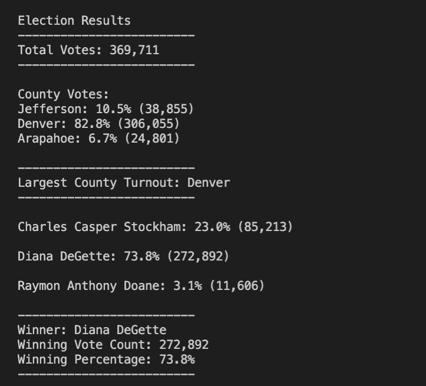

# Election_Analysis

## Project Overview

A Colorado Board of Elections employee has given us the following tasks to complete the election audit of a recent local congressional election. 

1. Calculate the total number of votes cast. 
2. Get a complete list of candidates who received votes. 
3. Calculate the total number of votes each candidate received. 
4. Calculate the percentage of votes each candidate won. 
5. Determine the winner of the election based on popular vote. 


## Resources 

* Data Source: election_results.csv
* Software: Python 3.7.6, Visual Studio Code 1.66.2


## Summary

The analysis of the election show that:
* There were 369,711 total votes case in the election. 
* The county results were:
    * Jefferson County received 10.5% of the vote and 38,855 total votes.
    * Denver County received 82.8% of the vote and 306,055 total votes.
    * Arapahoe County received 6.7% of the vote and 24,801 total votes.
* Denver County received the largest number of votes. 
* The candidates were: 
    * Charles Casper Stockham
    * Diana DeGette
    * Raymon Anthony Doane
* The candidate results were: 
    * Charles Casper Stockham received 23.0% of the vote and 85,213 total votes.
    * Diana DeGette received 73.8% of the vote and 272,892 total votes.
    * Raymon Anthony Doane received 3.1% of the vote and 11,606 total votes.
* The winner of the election was:
    * **Diana DeGette**, who received 73.8% of the votes and 272,892 total votes. 


See results from the output [election_analysis.txt file](analysis/election_analysis.txt) below:


## Proposal

In summary, our `PyPoll.py` script allowed us to quickly pull vote counts and percentages by county and candidate. We were able to also use this information to then determine the county with the largest turnout as well as the winning candidate. 

By providing a small number of data points, this same analysis can be done for any election; running this script on another election dataset is as simple as adding the desired `.csv` file to the `Resources` directory, then changing the filename associated with the `file_to_load` variable in `PyPoll.py`. 

### Suggestions for further modifications
1. with relatively simple changes to the existing script, other data points could be included and analyzed with ease, e.g. 'Political Party', 'Candidate Education Level', 'Years of Political Experience', etc. 
2. a refactor might be useful in the long-run; core functionality could be placed into functions, which would greatly reduce the amount of repeated code.

re: suggestion #2, please see this proof-of-concept code below. This could allow the user to quickly analyze any column in a given input file. The user might also wish to do conduct an analysis on all columns -- this would allow for that flexibility without needing to write unique loops for each distinct column.

```
import csv
import os

# Add a variable to load a file from a path.
file_to_load = os.path.join('.', 'Resources', 'election_results.csv')

def summarize(csv_file, column_name):
    '''
    Takes as inputs a `.csv` file and the desired name of the column.

    Returns a tuple with the total row count, the unique names in the given column, and a dictionary that consists of {name: row count, ...}

    If an invalid `column_name` argument is provided, row_count, name_options, votes_dict will return 0, an empty list, and an empty dictionary, respectively. 
    '''
    row_count = 0
    name_options = []
    votes_dict = {}
    try: 
        with open(file_to_load) as election_data:
            reader = csv.reader(election_data)
            header = next(reader)
            column_index = header.index(column_name)
            for row in reader:
                row_count += 1
                name = row[column_index]
                if name not in name_options:
                    name_options.append(name)
                    votes_dict[name] = 0
                votes_dict[name] += 1
    except ValueError:
        print(f'{column_name} does not match any column names in the provided file.')
    return row_count, name_options, votes_dict

total_votes, candidate_names, candidate_votes = summarize(file_to_load, 'Candidate') 

print(total_votes) 
print(candidate_names)
print(candidate_votes)
```

The terminal output for the above script looks like this: 
```
369711
['Charles Casper Stockham', 'Diana DeGette', 'Raymon Anthony Doane']
{'Charles Casper Stockham': 85213, 'Diana DeGette': 272892, 'Raymon Anthony Doane': 11606}
```
